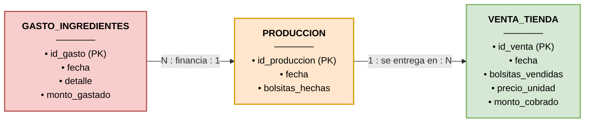

# 📊 Sistema de Control de Rentabilidad y Producción - Karinto

Este repositorio contiene el diseño e implementación de una base de datos relacional orientada a la evaluación financiera y control operativo para un microemprendimiento artesanal de elaboración de **Karinto** (producto comercializado a Bs 2.00 / unidad en canales B2B locales).

---

## 📌 Contexto del Negocio y Problemática

En un entorno con inflación en los insumos (harina, azúcar, aceite y empaques), mantener precios fijos de venta ($0.50 \text{ Bs/gramo}$ o $2.00 \text{ Bs}$ por bolsita) puede derivar en **márgenes negativos o pérdida operativa**.

El objetivo central de este sistema es **cruzar el costo real de materias primas con el volumen de producción** para determinar si el margen bruto cubre la fabricación antes de la distribución a tiendas clientes.

---

## 📐 Modelo Conceptual y Diagrama de Entidades

El flujo del modelo conecta las salidas financieras (gastos de producción) con los ingresos reales generados por ventas directas:

$$\text{Ganancia Neta} = \text{Ingresos por Ventas} - \text{Costo Total de Insumos}$$



---

## 🛠️ Esquema Relacional en SQL

Script de creación de tablas para MySQL / PostgreSQL:

```sql
-- 1. Gastos de Materia Prima e Insumos (Salidas)
CREATE TABLE Gasto_Ingredientes (
    gasto_id INT PRIMARY KEY AUTO_INCREMENT,
    fecha DATE NOT NULL,
    detalle VARCHAR(100) NOT NULL,
    monto_gastado DECIMAL(10, 2) NOT NULL
);

-- 2. Registro de Lote de Producción (Control de Inventario Fabricado)
CREATE TABLE Produccion (
    produccion_id INT PRIMARY KEY AUTO_INCREMENT,
    fecha DATE NOT NULL,
    bolsitas_hechas INT NOT NULL
);

-- 3. Registro de Ventas Realizadas a Tiendas (Entradas)
CREATE TABLE Venta_Tienda (
    venta_id INT PRIMARY KEY AUTO_INCREMENT,
    fecha DATE NOT NULL,
    bolsitas_vendidas INT NOT NULL,
    precio_unidad DECIMAL(6, 2) DEFAULT 2.00,
    monto_cobrado DECIMAL(10, 2) NOT NULL
);
```

---

## 📈 Consulta Analítica: Diagnóstico de Rentabilidad

Ejecute la siguiente consulta para evaluar el margen operativo global del periodo:

```sql
SELECT 
    (SELECT COALESCE(SUM(monto_gastado), 0) FROM Gasto_Ingredientes) AS total_gastado_compras,
    (SELECT COALESCE(SUM(monto_cobrado), 0) FROM Venta_Tienda) AS total_ingresos_ventas,
    (
        (SELECT COALESCE(SUM(monto_cobrado), 0) FROM Venta_Tienda) - 
        (SELECT COALESCE(SUM(monto_gastado), 0) FROM Gasto_Ingredientes)
    ) AS ganancia_neta_real;
```

---

## 📁 Estructura del Repositorio

* `README.md` — Documentación conceptual y diagrama Mermaid.
* `schema.sql` — DDL para creación de tablas e índices.
* `queries.sql` — Consultas de análisis financiero y costo unitario.